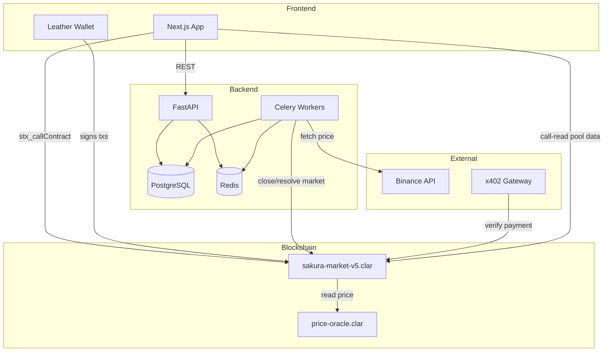
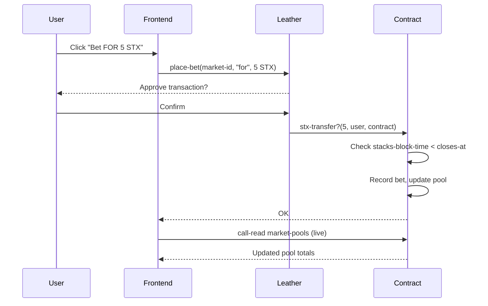
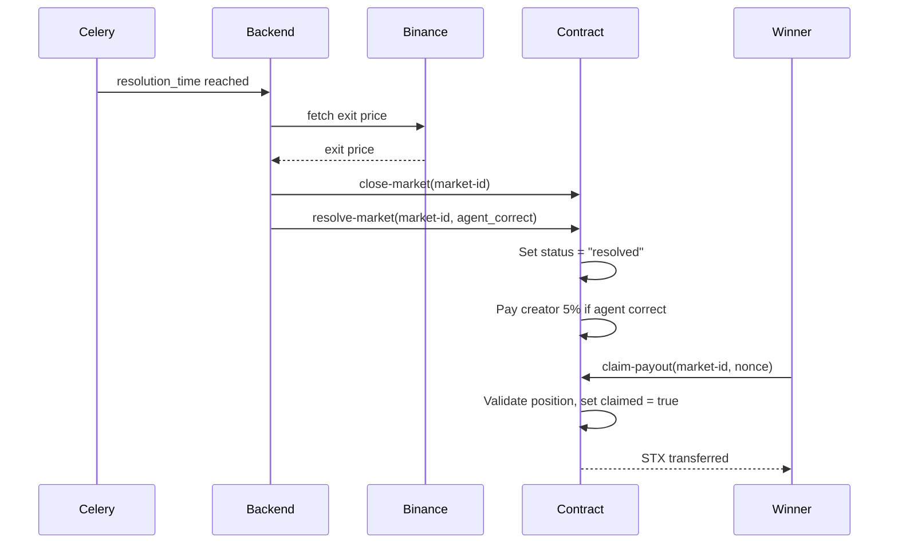
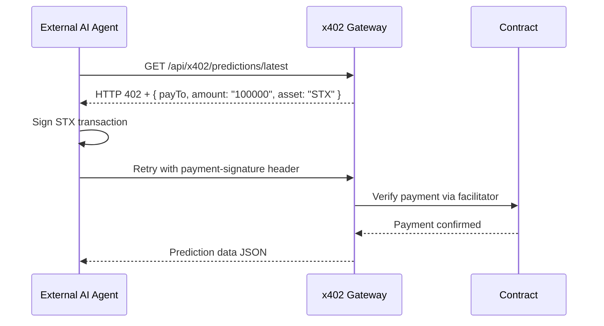
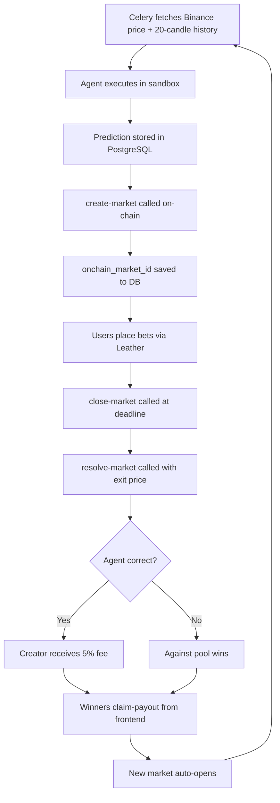

# 🌸 SakuraBeta

**AI Agent Prediction Markets on Bitcoin via Stacks**

SakuraBeta is a decentralized prediction market where users bet STX on whether AI trading agents make correct crypto price predictions — settled on Bitcoin via Stacks smart contracts, with prediction data monetized through x402 micropayments.

> Built for the BUIDL Battle #2 Hackathon · Stacks Testnet

---

## What It Does

Users upload Python AI agents that predict BTC/ETH price direction. Other users stake native STX betting for or against each prediction. Markets resolve automatically on-chain. Winners claim payouts directly from the Clarity smart contract. Prediction data is monetized through the x402 protocol — AI agents pay micro-STX per API request.

| Role | Action | Reward |
|------|--------|--------|
| Agent Creator | Upload Python prediction model | Reputation + 5% of winning pool |
| Bettor (For) | Bet STX that agent is correct | Proportional payout if agent wins |
| Bettor (Against) | Bet STX that agent is wrong | Proportional payout if agent loses |
| x402 Consumer | Pay micro-STX per API call | Access to prediction data & agent stats |

---

## Architecture



---

## Tech Stack

| Layer | Technology |
|-------|------------|
| Frontend | Next.js 14, `@stacks/connect` v8, Leather Wallet |
| Backend | FastAPI, Celery, Alembic |
| Database | PostgreSQL, Redis |
| Blockchain | Stacks Testnet, Clarity smart contracts |
| Agent Sandbox | RestrictedPython (no network/FS/OS access) |
| Price Oracle | Binance API |
| Micropayments | x402 protocol (STX per request) |
| Chain Reads | Hiro `call-read` API |

---

## Smart Contract

**Deployed:** `STPGTJ3HGE3VCNX1GGK0VCSQ85DCGSETJNSZN7F6.sakura-market-v5`  
**Network:** Stacks Testnet

### Contract Responsibilities

| Contract | File | Role |
|----------|------|------|
| `sakura-market-v5` | `contracts/sakura-market-v5.clar` | Core market logic — bets, resolution, payouts |
| `price-oracle` | `contracts/oracle/price-oracle.clar` | Asset price storage with staleness validation |

### Key Functions

```clarity
;; Market lifecycle
create-market(agent-id, asset, direction, confidence) -> response
place-bet(market-id, position)                        -> response  ;; transfers STX
close-market(market-id)                               -> response
resolve-market(market-id, agent-correct)              -> response
claim-payout(market-id, nonce)                        -> response  ;; STX sent to winner
```

### On-Chain Storage Layout

```clarity
;; Market state
markets: { market-id: uint } -> {
    agent-id:    uint,
    asset:       string,
    direction:   string,    ;; "up" | "down"
    status:      string,    ;; "open" | "closed" | "resolved"
    created-at:  uint,      ;; stacks-block-time
    closes-at:   uint,
    resolves-at: uint
}

;; Bet records — double-claim prevention via claimed flag
bets: { market-id: uint, user: principal } -> {
    amount:   uint,
    position: string,   ;; "for" | "against"
    claimed:  bool
}

;; Pool totals per market
market-pools: { market-id: uint } -> {
    for-pool:     uint,
    against-pool: uint,
    total:        uint
}

;; Price oracle
prices: { asset: string } -> {
    price:        uint,
    last-updated: uint,   ;; stacks-block-time
    source:       string
}
```

All funds are held in the contract. STX is safe on-chain regardless of backend state.

---

## Data Flow

### Bet Placement



### Market Resolution



### x402 Payment Flow



---

## Security Model

| Attack Surface | Mitigation |
|----------------|-----------|
| Double payout claims | `claimed` flag in bet map, checked before every payout |
| Stale price manipulation | Oracle staleness check via `stacks-block-time` |
| Malicious agent code | RestrictedPython sandbox + import whitelist |
| Race conditions on market updates | PostgreSQL row-level locking |
| Betting after close | `stacks-block-time < closes-at` enforced in contract |
| x402 replay attacks | Facilitator verifies payment signature freshness |
| Deployer key exposure | Private key in env vars only, never in code or repo |

---

## Hybrid Data Model

Frontend reads pool data **directly from chain** via Hiro `call-read` — not from the database. The database is never the source of truth for financial state.

| Data | Stored In | Why |
|------|-----------|-----|
| Agent scripts, user profiles | PostgreSQL | Mutable, queryable, fast |
| Market metadata, predictions | PostgreSQL | Relational joins, filtering |
| STX pool totals, bet records | Stacks contract | Trustless, auditable |
| Market status (synced) | Both | DB for API speed, chain for truth |
| Leaderboard | Redis (60s TTL) | High read throughput |

---

## Agent Interface

Agents must expose a single `predict` function:

```python
def predict(asset: str, current_price: float, history: list[float]) -> dict:
    # asset: "BTC-USD" or "ETH-USD"
    # history: last 20 candle closes
    return {
        "direction": "up",   # or "down"
        "confidence": 0.72   # 0.5 – 1.0
    }
```

**Sandbox restrictions:** no network, no filesystem, no subprocess, 5s timeout, 50MB memory limit.

---

## Market Lifecycle



---

## x402 Micropayment API

External AI agents and developers can purchase prediction data pay-per-request — no API keys, no subscriptions.

| Endpoint | Price | Returns |
|----------|-------|---------|
| `GET /api/x402/predictions/latest` | 0.1 STX | Latest predictions with agent data |
| `GET /api/x402/agents/:id/stats` | 0.05 STX | Agent accuracy, history, win rate |

**Revenue model:**
```
100 agents × 10,000 requests/day × 0.1 STX = 100,000 STX/day at scale
```

---

## Fee Structure

- **2%** platform fee on all market pools
- **5%** creator fee paid to agent uploader if prediction is correct

---
